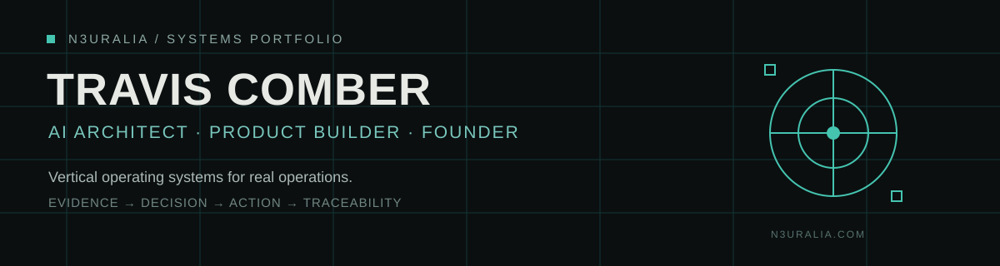
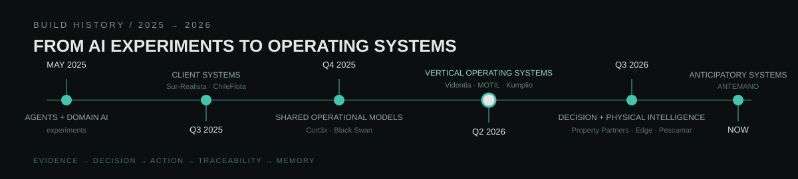

<p align="center">
  
</p>

<p align="center">
  <a href="https://n3uralia.com"><strong>N3uralia</strong></a>&nbsp;&nbsp;·&nbsp;&nbsp;
  <a href="https://n3uralia360.art"><strong>N3uralia360</strong></a>&nbsp;&nbsp;·&nbsp;&nbsp;
  <a href="https://v1sioncraft.art"><strong>VisionCraft</strong></a>&nbsp;&nbsp;·&nbsp;&nbsp;
  <a href="https://clar1ty.art"><strong>Clar1ty</strong></a>
</p>

<p align="center">
  <code>VERTICAL OPERATING SYSTEMS</code>&nbsp;&nbsp;
  <code>DECISION INTELLIGENCE</code>&nbsp;&nbsp;
  <code>PHYSICAL INTELLIGENCE</code>&nbsp;&nbsp;
  <code>SPATIAL MEDIA</code>
</p>

---

## N3uralia

I design and build **vertical operating systems for real operations**.

The pattern is consistent across industries: connect fragmented data, workflows, documents, people and machine intelligence into one governed operating layer that can observe reality, support decisions, execute work and preserve evidence.

<p align="center"><strong>Evidence → Decision → Action → Traceability</strong></p>

AI is part of the operating system, not a decorative layer. Canonical data, deterministic rules, permissions, human authority and measurable outcomes remain the source of operational truth.

---

## Build Evolution

<p align="center">
  
</p>

The GitHub account is the engineering record behind the portfolio: original systems, earlier generations, private client work, prototypes and upstream tools evaluated during development. The curated history keeps those categories explicit and never presents a fork or mirror as original N3uralia work.

<p align="center"><a href="./HISTORY.md"><strong>Read the verified build history →</strong></a></p>

---

## Ecosystem

| Platform | Role in the ecosystem | Product |
|---|---|---|
| **N3uralia** | Engineering studio for vertical operating systems, operational intelligence and production AI | [n3uralia.com](https://n3uralia.com) |
| **N3uralia360** | Immersive worlds, fulldome, VR, heritage and spatial-media experiences | [n3uralia360.art](https://n3uralia360.art) |
| **VisionCraft** | AI motion and video workflows, image-to-video and structure-preserving animation | [v1sioncraft.art](https://v1sioncraft.art) |
| **Clar1ty** | Visual-intelligence system for professional enhancement, restoration and preservation-first imaging | [clar1ty.art](https://clar1ty.art) |

---

# Systems Portfolio

### Executive map

| System | Vertical operating system | Core outcome | Stage | Product |
|---|---|---|---|---|
| **Property Partners Intelligence** | Real Estate Intelligence OS | Market intelligence + professional valuation + commercial control | **Production** | [ppartnersgroup.app](https://ppartnersgroup.app) |
| **Black Swan Facility Core** | Facility & Hospitality OS | Hospitality, people, assets, inventory, procurement, maintenance, finance and events in one operating layer | **Mature** | [blackswn.app](https://blackswn.app) |
| **ChileFlota / LABBE** | Transport Compliance OS | Evidence-driven document, fleet, driver and subcontractor compliance | **Mature** | [chileflota.app](https://chileflota.app) |
| **MOTIL** | Mining Operations OS | Production, maintenance, warehouse, HSE, documents, finance and management in one operational model | **Mature** | [motil.app](https://motil.app) |
| **Kumplio** | Privacy Compliance OS | Turn regulatory gaps into accountable work, evidence and auditable closure | **Active** | [kumplio.app](https://www.kumplio.app/es) |
| **Videntia** | Industrial Property Intelligence OS | Trademarks, patents, technologies, monitoring, cases, governance and decision intelligence | **Active** | [videntia.app](https://videntia.app) |
| **Clar1ty** | Visual Intelligence OS | Analyze, enhance and restore images while preserving identity and visual structure | **Active** | [clar1ty.art](https://clar1ty.art) |
| **Sent1nels** | Cybersecurity Operations OS | Detection, incidents, response, playbooks and security intelligence | **Active** | [sent1nels.com](https://sent1nels.com) |
| **Sur-Realista** | Territorial Real Estate OS | Geospatial property operations, CRM, tasks, communications and portfolio intelligence | **Active** | — |
| **EcoSueloLab** | Agricultural Intelligence OS | Satellite and field intelligence translated into actionable farm decisions | **Active** | — |
| **SegurIA** | Operational Security OS | Cameras, sensors and access control converted into actionable security operations | **Active** | [seguria.tech](https://seguria.tech) |
| **Despega Tu Carrera** | Career Intelligence OS | Personal diagnosis, skills, AI coaching and an executable development route | **Active** | [despegatucarrera.com](https://despegatucarrera.com) |
| **Cort3x** | Innovation Intelligence OS | Research, opportunity mapping, structured strategy and execution | **Active** | [cort3x.app](https://cort3x.app) |
| **ANTEMANO** | Anticipatory Intelligence OS | Convert weak signals into useful lead time before operational impact | **R&D** | [antemano.app](https://www.antemano.app) |
| **N3uralia Edge Intelligence** | Physical Intelligence OS | Physical evidence → inference → observation → review → dataset → model lifecycle | **R&D** | — |
| **ClaimIA** | Insurance Claims OS | Claims, OCR, evidence, fraud signals, review and decision support | **R&D** | — |
| **N3uLexCore / LexCore** | Legal Intelligence OS | Contract ingestion, clause intelligence, risks and review workflows | **R&D** | — |
| **Pescamar · UniGrade** | Seafood Quality OS | Lot evidence, mass balance, quality, yield and export traceability | **MVP** | — |
| **MermasApp** | Manufacturing Efficiency OS | Waste visibility, financial impact, alerts and explainable operational intelligence | **Product** | [N3uralia](https://n3uralia.com) |
| **PR1SM** | Content Intelligence OS | AI-assisted content operations and controlled production workflows | **Prototype** | — |
| **Botel / LumiStay** | Hospitality OS | Hotel operations and management-control exploration | **Prototype** | — |
| **Parrotfy Agent Layer** | Agentic Operations | Execute supported business-system work from natural-language interfaces | **Active** | — |
| **N3uralia Nano Agents** | Agentic Operations Layer | Specialized agents for narrow operational responsibilities | **Platform** | [N3uralia](https://n3uralia.com) |
| **Agent Matrix** | Multi-Agent Control Plane | Observe, coordinate and govern agentic systems | **Platform** | [N3uralia](https://n3uralia.com) |

---

# Flagship Operating Systems

<table>
<tr>
<td width="50%" valign="top">

### Property Partners Intelligence

**Real Estate Intelligence OS**

A production operating system connecting market supply, canonical property identity, geospatial neighborhoods, transaction evidence, professional valuation and commercial management.

`Market → Comparables → Decision → Approval → Issued Evidence`

[Open product](https://ppartnersgroup.app)

</td>
<td width="50%" valign="top">

### Black Swan Facility Core

**Facility & Hospitality OS**

A shared operational core for bookings, people, assets, inventory, procurement, maintenance, finance, events and administration — built around canonical objects instead of disconnected modules.

`Reservation · Asset · Purchase · Work · Finance`

[Open product](https://blackswn.app)

</td>
</tr>
<tr>
<td width="50%" valign="top">

### ChileFlota / LABBE

**Transport Compliance OS**

Evidence-driven operations for transportistas, subcontractors, drivers, vehicles and documentary compliance. Includes high-volume evidence, OCR, verification, reconciliation and operational control.

`Evidence → Validation → Compliance → Action`

[Open product](https://chileflota.app)

</td>
<td width="50%" valign="top">

### MOTIL

**Mining Operations OS**

Not a generic ERP. MOTIL models the mining operation itself: production, maintenance, warehouse, HSE, documents, purchasing, finance and management intelligence in one traceable system.

`Alert → Work Order → Resource → HSE → Evidence → KPI`

[Open product](https://motil.app)

</td>
</tr>
<tr>
<td width="50%" valign="top">

### Kumplio

**Privacy Compliance OS**

Transforms regulatory obligations and gaps into an executable operating model with owners, deadlines, evidence, controls and human review.

`Discover → Gap → Action → Evidence → Review`

[Open product](https://www.kumplio.app/es)

</td>
<td width="50%" valign="top">

### Videntia

**Industrial Property Intelligence OS**

Connects trademarks, patents, technologies, research, competitive monitoring, cases, governance, risk and decision briefs in one traceable intellectual-property workflow.

`Research → Signal → Case → Governance → Decision`

[Open product](https://videntia.app)

</td>
</tr>
</table>

---

# Creative Intelligence

<table>
<tr>
<td width="33%" valign="top">

### N3uralia360

**Immersive & Spatial Media**

Fulldome environments, cultural and heritage experiences, VR, spatial storytelling and large-format generative media.

[n3uralia360.art](https://n3uralia360.art)

</td>
<td width="33%" valign="top">

### VisionCraft

**AI Motion System**

Professional image-to-video and motion workflows designed to preserve composition, structure and artistic intent.

[v1sioncraft.art](https://v1sioncraft.art)

</td>
<td width="33%" valign="top">

### Clar1ty

**Visual Intelligence OS**

Professional enhancement and restoration where the source image stays authoritative: identity, faces, textiles, artifacts and cultural detail are preserved rather than reinvented.

[clar1ty.art](https://clar1ty.art)

</td>
</tr>
</table>

---

# Experimental Engineering

### Ableton AI Control Bridge

A local, auditable protocol bridge that lets AI agents control **Ableton Live** through explicit JSON commands rather than fragile screen automation. It combines an HTTP control layer, validation, approval/history, UDP transport, Max for Live and Live API integration.

`AI / Agent → JSON → Control Bridge → Max for Live → Ableton Live`

[Explore the public project](https://github.com/traviscomber/ableton-ai-control-bridge)

This section is intentionally separate from N3uralia's commercial operating systems. It represents technically distinctive experimental engineering.

---

# The N3uralia Pattern

```text
REAL WORLD / BUSINESS OPERATION
              │
              ▼
        CANONICAL EVIDENCE
              │
              ▼
   OPERATIONAL / DOMAIN MODEL
              │
       ┌──────┴──────┐
       ▼             ▼
 DETERMINISTIC      AI
    RULES        INTELLIGENCE
       │             │
       └──────┬──────┘
              ▼
          DECISION
              │
              ▼
           ACTION
              │
              ▼
       AUDITABLE OUTCOME
              │
              └──────────────► MEMORY / LEARNING
```

This is why most N3uralia products are better understood as **operating systems for a vertical** rather than dashboards, apps or isolated AI features.

---

## Wider N3uralia Portfolio

<details>
<summary><strong>Open full product / project index</strong></summary>

### Operational systems

Property Partners · Black Swan Facility Core · ChileFlota / LABBE · MOTIL · Kumplio · Videntia · Sur-Realista · EcoSueloLab · SegurIA · Parrotfy · Pescamar / UniGrade · Botel / LumiStay

### Intelligence systems

ANTEMANO · Edge Intelligence · ClaimIA · N3uLexCore · Sent1nels · Cort3x · PR1SM · MermasApp · Nano Agents · Agent Matrix

### Creative systems

N3uralia360 · VisionCraft · Clar1ty · IMPAX Heritage

### Wider / earlier N3uralia lines

M3NTIS · 1NCUBATOR · DoubleC · ScanGlobal · Walnuss

</details>

---

## Engineering Principles

`Canonical data before AI` · `Missing information is not zero` · `Human authority for consequential decisions` · `Evidence remains visible` · `Server-side authorization` · `Observable automation` · `Release gates` · `Rollback readiness`

---

<p align="center">
  <strong>Building systems that understand reality well enough to act on it.</strong>
</p>

<p align="center">
  <a href="https://n3uralia.com">n3uralia.com</a>&nbsp;&nbsp;·&nbsp;&nbsp;
  <a href="https://n3uralia360.art">n3uralia360.art</a>&nbsp;&nbsp;·&nbsp;&nbsp;
  <a href="https://v1sioncraft.art">v1sioncraft.art</a>&nbsp;&nbsp;·&nbsp;&nbsp;
  <a href="https://clar1ty.art">clar1ty.art</a>
</p>